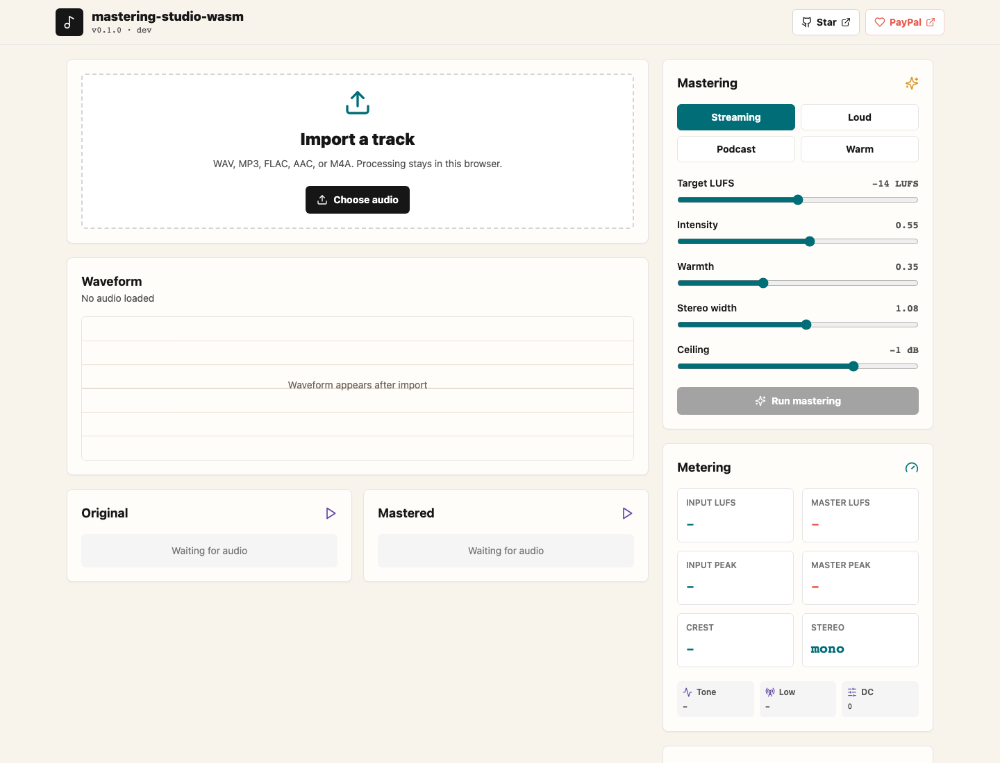
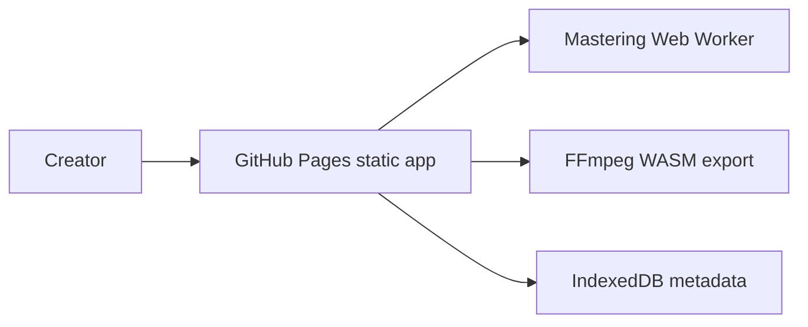

# mastering-studio-wasm

Browser-based automatic audio mastering with Web Audio, EBU R128 loudness analysis, and FFmpeg WASM export.


Live site: https://baditaflorin.github.io/mastering-studio-wasm/

Repository: https://github.com/baditaflorin/mastering-studio-wasm

Support: https://www.paypal.com/paypalme/florinbadita



## What It Does

`mastering-studio-wasm` is a private, browser-only mastering tool for musicians, podcasters, and creators who want a fast polished master without uploading audio to a server.

It imports common audio files, analyzes loudness, applies an adaptive mastering chain, previews original versus mastered audio, and exports WAV or MP3.

## Quickstart

```bash
npm install
make install-hooks
make dev
make test
make build
```

## Architecture

The app is Mode A: Pure GitHub Pages. Audio decoding, analysis, adaptive mastering, preview, and export happen in the browser. FFmpeg WASM is lazy-loaded only when compressed export is requested.



Architecture docs: docs/architecture.md

ADRs: docs/adr/

Deployment guide: docs/deploy.md

Privacy: docs/privacy.md

## Local Commands

```bash
make help
make dev
make build
make test
make smoke
make pages-preview
```

## Versioning

The published page displays the app version and git commit embedded at build time through `VITE_APP_VERSION` and `VITE_GIT_COMMIT`.
