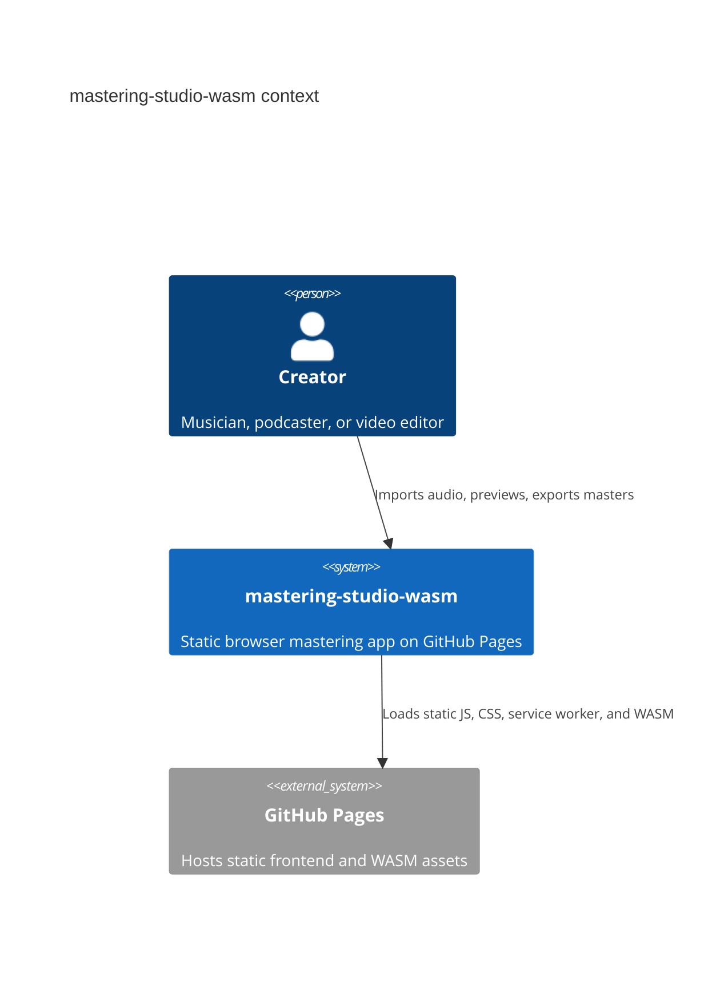
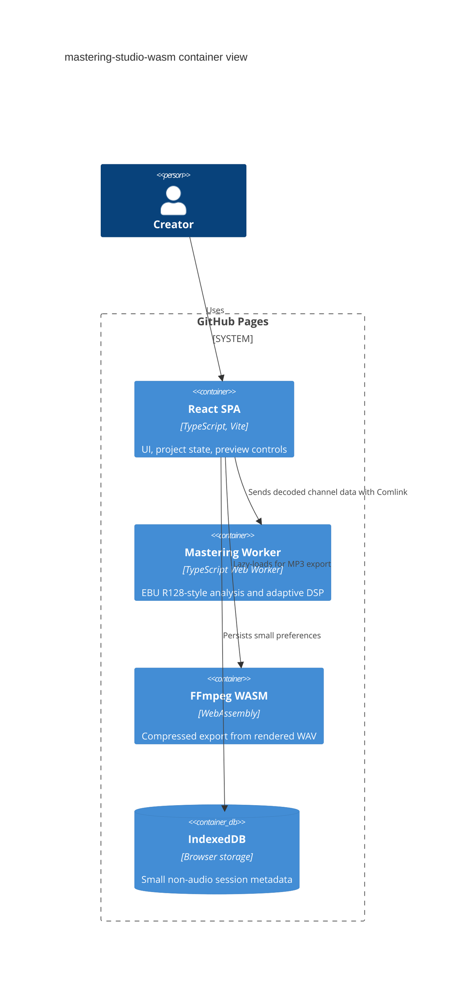

# Architecture

## Context

```mermaid
C4Context
  title mastering-studio-wasm context
  Person(creator, "Creator", "Musician, podcaster, or video editor")
  System(app, "mastering-studio-wasm", "Static browser mastering app on GitHub Pages")
  System_Ext(github, "GitHub Pages", "Hosts static frontend and WASM assets")
  Rel(creator, app, "Imports audio, previews, exports masters")
  Rel(app, github, "Loads static JS, CSS, service worker, and WASM")
```

## Container

```mermaid
C4Container
  title mastering-studio-wasm container view
  Person(creator, "Creator")
  System_Boundary(pages, "GitHub Pages") {
    Container(spa, "React SPA", "TypeScript, Vite", "UI, project state, preview controls")
    Container(worker, "Mastering Worker", "TypeScript Web Worker", "EBU R128-style analysis and adaptive DSP")
    Container(ffmpeg, "FFmpeg WASM", "WebAssembly", "Compressed export from rendered WAV")
    ContainerDb(storage, "IndexedDB", "Browser storage", "Small non-audio session metadata")
  }
  Rel(creator, spa, "Uses")
  Rel(spa, worker, "Sends decoded channel data with Comlink")
  Rel(spa, ffmpeg, "Lazy-loads for MP3 export")
  Rel(spa, storage, "Persists small preferences")
```

There is no runtime backend in v1.
